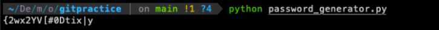

# Project Name

This is a sample project README file that can be used as a template for other projects.

### Table of Contents

- [Project Description]()
- [Installation]()
- [Usage]()
- [Contributing]()
- [Credits]()
- [License]()

### Project Description

This project is a simple Python program that generates a random password and saves it to a file. it solves the problem of having to come up with a secure password that is difficult to guess. The program generates a password that is 16 characters long and contains a mix of uppercase and lowercase letters, numbers, and symbols.

### Installation

To use this program, you need to have Python 3 installed on your computer. you can download Pytho from the official website: [Python](https://www.python.org/downloads/)

Once you have Python installed , you can download the program code for the Github Repository:

```
git clone https://github.com/yourusername/yourproject
```

### Usage

To use program, open a terminal or command prompt and navigate to directory where the program code is saved. Then run the following command:

```
python password_generator.py
```

The program will generatae a random password and same it to a file called "password.txt" in same directory.

If you would like to contribute to this project, please sumbit pull request with your changes. Make sure to follow the coding style and guidelines of the project.


### Contributing

If you would like to contribute to this project, please sumbit a pull request with your changes. Make sure to follow the coding style and guidelines of the project.

### Credits

This project was created by Kshitiz Rana.

### License

This project is licensed under MIT LICENSE file for more information.

By-Kshitiz
